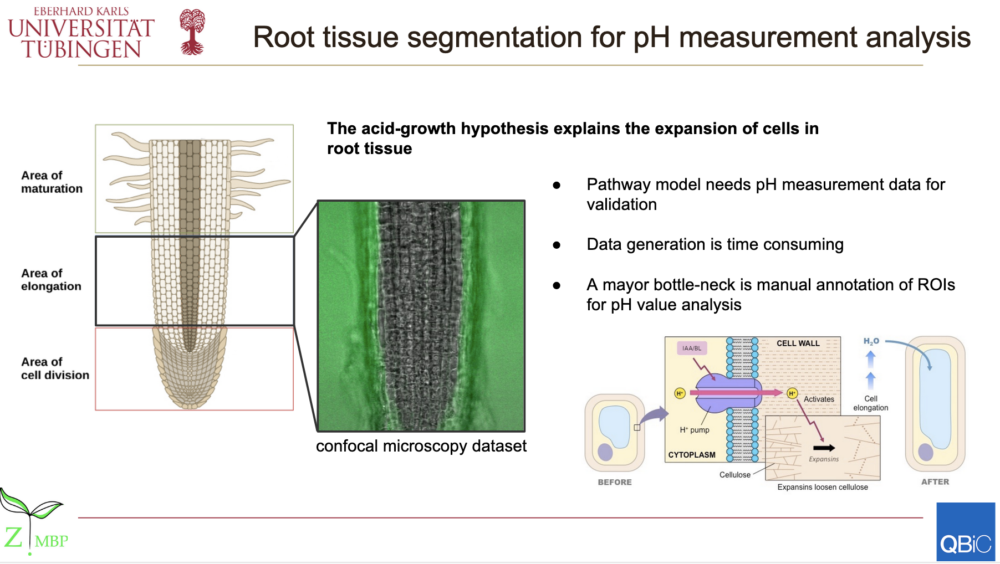

========================
root-tissue-segmentation
========================

.. image:: https://github.com/waseju/root-tissue-segmentation/workflows/Train%20root-tissue-segmentation%20using%20CPU/badge.svg
        :target: https://github.com/waseju/root-tissue-segmentation/actions?query=workflow%3A%22Train+root-tissue-segmentation+using+CPU%22
        :alt: Github Workflow CPU Training root-tissue-segmentation Status

.. image:: https://github.com/waseju/root-tissue-segmentation/workflows/Publish%20Container%20to%20Docker%20Packages/badge.svg
        :target: https://github.com/waseju/root-tissue-segmentation/actions?query=workflow%3A%22Publish+Container+to+Docker+Packages%22
        :alt: Publish Container to Docker Packages

.. image:: https://github.com/waseju/root-tissue-segmentation/workflows/mlf-core%20linting/badge.svg
        :target: https://github.com/waseju/root-tissue-segmentation/actions?query=workflow%3A%22mlf-core+lint%22
        :alt: mlf-core lint

.. image:: https://github.com/waseju/root-tissue-segmentation/actions/workflows/publish_docs.yml/badge.svg
        :target: https://waseju.github.io/root-tissue-segmentation
        :alt: Documentation Status

Reproducible semantic segmentation of fluorescence microscopy images of root tissue samples from A. thaliana. The training dataset consist 2D fluorescence microscopy (FM) images with one brightfield channel, and two fluorescence channels for pH sensitive markers. This project trains Pytorch-based U-Net models (`U-Net`_, `U-Net++`_, `U2-Net`_) to predict segmentation masks that classify pixels into 5 clases, background, root, meristematic Zone (MZ), early elongation zone (EEZ), and late elongation zone (LEZ).

.. image:: docs/images/fm_seg_dataset.png
        :alt: FM dataset
        :scale: 1

The figure above shows the following color-coded labels: Background (white), Root (blue), Meristematic Zone (red), Early Elongation Zone (green), Late Elongation Zone (cyan).

The project includes automated HPO.

Activity Diagram
----------------

.. image:: docs/images/rts-model-activity-diagram.png
        :alt: Activity diagram
        :scale: 1

Reproducibility Results
-----------------------

A reproducibility analysis was conducted using this project. Models were trained a number of times (n = 10), and segmentation performance (IoU) was evaluated on the test set for each of the training runs. Quantitative results show no variation between training runs.

.. image:: docs/images/rep_of_pred.png
        :alt: Reproducibility of results
        :scale: 1

Background Summary Slide
-------------

Credits
-------

This package was created with `mlf-core`_ using cookiecutter_.

.. _U-Net: https://lmb.informatik.uni-freiburg.de/Publications/2015/RFB15a/
.. _U-Net++: https://arxiv.org/abs/1807.10165
.. _U2-Net: https://arxiv.org/abs/2005.09007
.. _mlf-core: https://mlf-core.readthedocs.io/en/latest/
.. _cookiecutter: https://github.com/audreyr/cookiecutter
