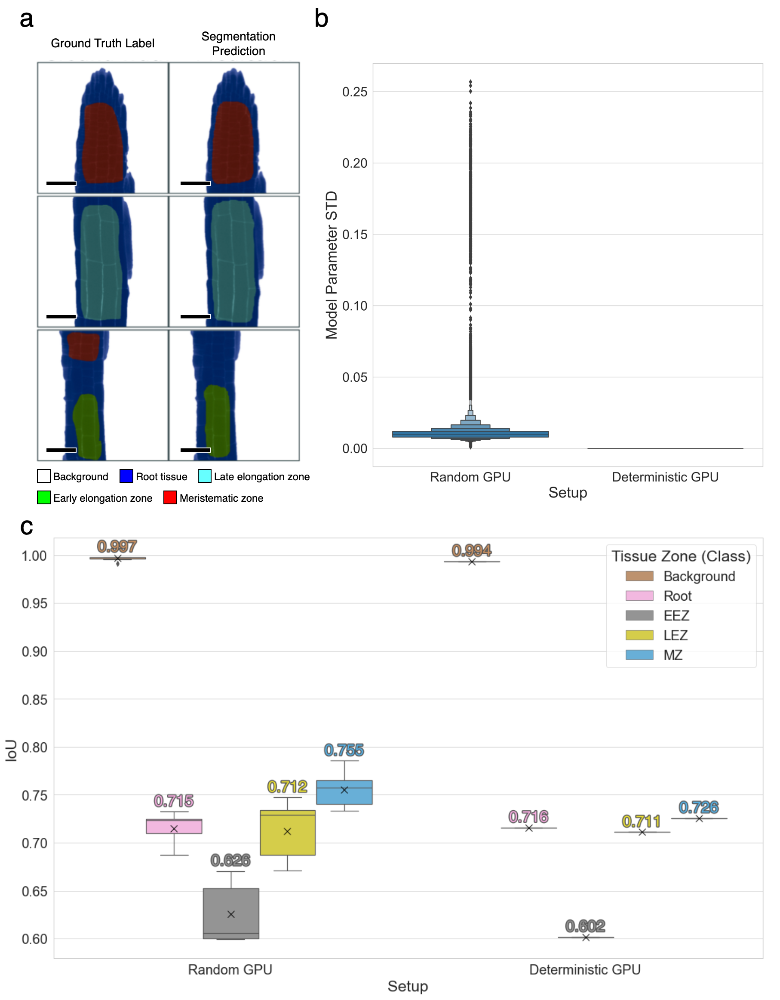

========================
root-tissue-segmentation
========================

.. image:: https://github.com/waseju/root-tissue-segmentation/workflows/Train%20root-tissue-segmentation%20using%20CPU/badge.svg
        :target: https://github.com/waseju/root-tissue-segmentation/actions?query=workflow%3A%22Train+root-tissue-segmentation+using+CPU%22
        :alt: Github Workflow CPU Training root-tissue-segmentation Status

.. image:: https://github.com/waseju/root-tissue-segmentation/workflows/Publish%20Container%20to%20Docker%20Packages/badge.svg
        :target: https://github.com/waseju/root-tissue-segmentation/actions?query=workflow%3A%22Publish+Container+to+Docker+Packages%22
        :alt: Publish Container to Docker Packages

.. image:: https://github.com/waseju/root-tissue-segmentation/workflows/mlf-core%20linting/badge.svg
        :target: https://github.com/waseju/root-tissue-segmentation/actions?query=workflow%3A%22mlf-core+lint%22
        :alt: mlf-core lint

.. image:: https://github.com/waseju/root-tissue-segmentation/actions/workflows/publish_docs.yml/badge.svg
        :target: https://waseju.github.io/root-tissue-segmentation
        :alt: Documentation Status

Deterministic deep-learning approach to segment microscopy images of root tissue samples from *A. thaliana*. The training dataset consist 2D fluorescence microscopy (FM) images with brightfield and fluorescence channels from pH sensitive markers, the dataset was named `PHDFM`_ (https://zenodo.org/record/5841376). The PHDFM dataset is composed of images of root tissue samples from A. thaliana, using the ratiometric fluorescent indicator 8‐hydroxypyrene‐1,3,6‐trisulfonic acid trisodium salt (HPTS). This semantic segmentation training dataset consists of 2D microscopy images (the brightfield channel for excitation at 405 nm). The images are 512x512 pixels in size, and were acquired with a target pixel size of 0.415133 µm. Each image contains a segmentation mask as an additional image channel (manually annotated by plant biologists). The segmentation masks classify pixels into 5 labels: background, root, meristematic Zone (MZ), early elongation zone (EEZ), and late elongation zone (LEZ). This deterministic training module employs the PHDFM dataset, and Pytorch-based U-Net models (`U-Net`_, `U-Net++`_, `U2-Net`_) to predict semantic segmentation masks.

.. image:: docs/images/fm_seg_dataset.png
        :alt: FM dataset
        :scale: 1

The project includes automated hyperparameter optimization, using the Optuna framework (https://optuna.org/). Optimal hyperparameters are used as default values in this training module.

Activity Diagram
----------------

.. image:: docs/images/rts-model-activity-diagram.png
        :alt: Activity diagram
        :scale: 1

Reproducibility Results
-----------------------

A reproducibility analysis was conducted using this training module, mainly by evaluating deterministic and non-deterministic training results. Qualitative and quantitative performance results of the U-Net^2 model, with assessment of deterministic training. (a) Model predictions and ground truth show a high similarity, missing predictions are sometimes obtained when there are multiple labels in the ground truth. (b) Letter-value plot of standard deviation values (STD) of U-Net^2 model parameters (weights and biases) across training runs (10 training runs per setup, n=10), the standard deviation of all 44.04 million trainable parameters was calculated for the Random (without random seed or deterministic settings) and Deterministic training setups (specified all random seeds and forced deterministic algorithms) (`mlf-core`_, https://arxiv.org/abs/2104.07651). (c) Boxplot of IoU performance on the test dataset (mean IoU of all images per class), after the training reproducibility test (n=10), this metric shows a large variance for all classes besides the background while using a non-deterministic setup and zero variance in all classes while using the deterministic setup, demonstrating full deterministic output of the training process. Scale bars = 53.14 µm.

Biological Background
---------------------

One of the key mechanisms influencing growth and morphogenesis of plants is cell elongation —a fast and irreversible increase in cellular size and volume. The kinetics and degree of cell elongation is regulated by several plant hormones as well as environmental signals and initially includes cell modification through apoplastic pH change and alteration in turgor pressure. One of the key plant hormones influencing this process are brassinosteroids (BR). The role of BR, and more specifically that of brassinolide (BL) is an attractive target in a wide range of research fields, including pathogen defense, body patterning, response to abiotic stresses and plant growth and development. Brassinosteroids are mainly perceived by the leucine-rich repeat (LRR) receptor-like kinase BRASSINOSTEROID-INSENSITIVE-1 (BRI1). The binding of BL leads to the dissociation of BRI1-inhibitors BIK1, BKI1 and BIR3, enabling interaction and transphosphorylation with the co-receptor BAK1 followed by the activation of the major plasma membrane-localized proton pumping Arabidopsis H+-ATPases (AHAs) AHA1 and AHA2. This leads to the acidification of the apoplast and hyperpolarization of the plasma membrane, enabling cell wall loosening and eventually cell elongation. Previous and recent experimental investigation of the BRI1 receptor complex  in the plasma membrane led to a mathematical model of the fast-response pathway by accessing  the apoplastic pH of Arabidopsis thaliana (A. thaliana) using fluorescence microscopy (FM) and the ratiometric fluorescent indicator 8‐hydroxypyrene‐1,3,6‐trisulfonic acid trisodium salt (HPTS). However, despite successful establishment of a mathematical model relying on HPTS imaging, additional spectro-microscopic, plant-derived data are required  to further expand and refine the model to capture additionally relevant parameters and processes, such as anisotropic growth in different root tissues and differential composition of BR-signaling complexes. Thus, to validate and further improve the the fast-response pathway model, it is prudent to continuously generate new microscopic image datasets using the HPTS fluorescent indicator and, in the future, other pH-sensitive fluorophores, and analyze different tissue zones based on their morphology. In the case of the root tip, we choose the late elongation zone (LEZ), the early elongation zone (EEZ), and the meristematic zone (MZ) as suitable tissues. The annotated image data can then be subjected to image processing and statistical analysis of the derived values as required for the assessment. However, manual annotation of regions of interest (ROI) that correspond to tissue zones is an arduous and time consuming task, which introduces a major bottleneck for the robust downstream quantitative analysis needed for a predictive modeling. 

.. image:: docs/images/bio_background.png
        :alt: Background slide
        :scale: 1
        :align: center

This package aims to conduct root tissue segmentation for pH measurement analysis based on FM data, to aid in the validation of the acid-growth hypothesis, which explains the expansion of cells in root tissue. This acid-growth pathway model needs substantial pH measurement data for validation, however data generation is time consuming, with manual annotation of ROIs for pH value analysis being the mayor bottle-neck.

Credits
-------

This package was created with `mlf-core`_ using cookiecutter_.

.. _PHDFM: https://zenodo.org/record/5841376
.. _U-Net: https://lmb.informatik.uni-freiburg.de/Publications/2015/RFB15a/
.. _U-Net++: https://arxiv.org/abs/1807.10165
.. _U2-Net: https://arxiv.org/abs/2005.09007
.. _mlf-core: https://mlf-core.readthedocs.io/en/latest/
.. _cookiecutter: https://github.com/audreyr/cookiecutter
