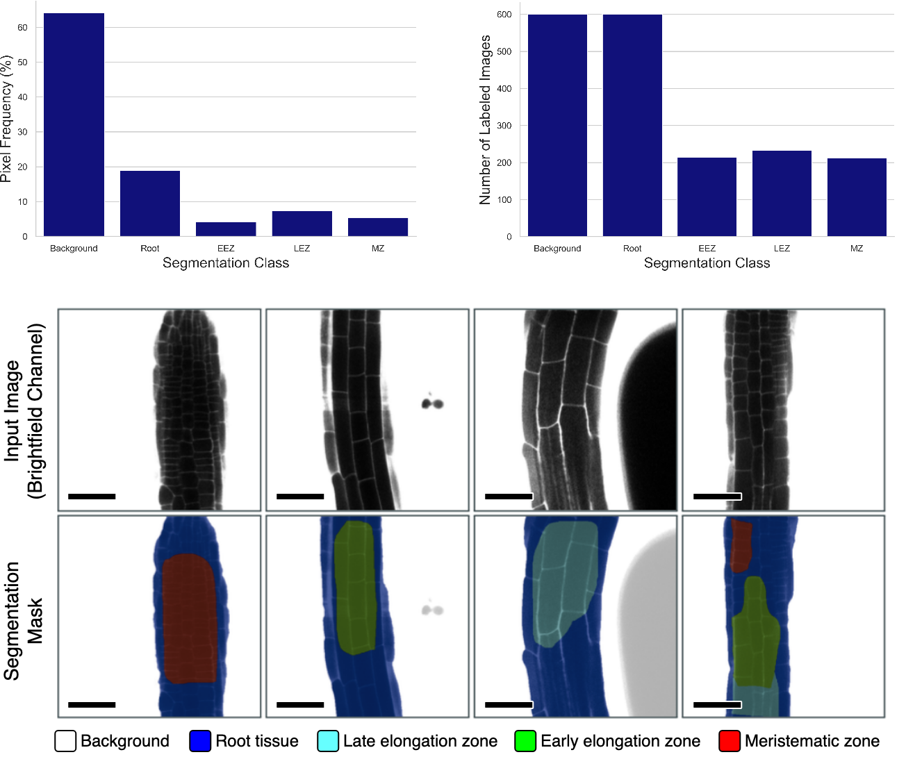

========================
root-tissue-segmentation
========================

.. image:: https://github.com/waseju/root-tissue-segmentation/workflows/Train%20root-tissue-segmentation%20using%20CPU/badge.svg
        :target: https://github.com/waseju/root-tissue-segmentation/actions?query=workflow%3A%22Train+root-tissue-segmentation+using+CPU%22
        :alt: Github Workflow CPU Training root-tissue-segmentation Status

.. image:: https://github.com/waseju/root-tissue-segmentation/workflows/Publish%20Container%20to%20Docker%20Packages/badge.svg
        :target: https://github.com/waseju/root-tissue-segmentation/actions?query=workflow%3A%22Publish+Container+to+Docker+Packages%22
        :alt: Publish Container to Docker Packages

.. image:: https://github.com/waseju/root-tissue-segmentation/workflows/mlf-core%20linting/badge.svg
        :target: https://github.com/waseju/root-tissue-segmentation/actions?query=workflow%3A%22mlf-core+lint%22
        :alt: mlf-core lint

.. image:: https://github.com/waseju/root-tissue-segmentation/actions/workflows/publish_docs.yml/badge.svg
        :target: https://waseju.github.io/root-tissue-segmentation
        :alt: Documentation Status

Reproducible, deep-learning approach to segment microscopy images of root tissue samples from *A. thaliana*. The training dataset consist 2D fluorescence microscopy images with brightfield and fluorescence channels from pH sensitive markers (PHDFM dataset: https://zenodo.org/record/5841376). The PHDFM dataset is composed of images of root tissue samples from A. thaliana, using the ratiometric fluorescent indicator 8‐hydroxypyrene‐1,3,6‐trisulfonic acid trisodium salt (HPTS). This semantic segmentation training dataset consists of 2D microscopy images (the brightfield channel for excitation at 405 nm), each containing a segmentation mask as an additional image channel (manually annotated by plant biologists). The segmentation masks classify pixels into 5 labels: background, root, meristematic Zone (MZ), early elongation zone (EEZ), and late elongation zone (LEZ). This deterministic training module employs Pytorch-based U-Net models (`U-Net`_, `U-Net++`_, `U2-Net`_) to predict semantic segmentation masks, based on the PHDFM dataset.

The project includes automated hyperparameter optimization, using the (Optuna framework: https://optuna.org/). Optimal hyperparameters are used as default values in this training module.

Activity Diagram
----------------

Reproducibility Results
-----------------------

A reproducibility analysis was conducted using this project. Models were trained a number of times (*n = 10*), and segmentation performance (IoU) was measured after each training run. Performance metrics show no variation between training runs.

.. image:: docs/images/rep_of_pred.png
        :alt: Reproducibility of results
        :scale: 1

Biological Background
---------------------

This package aims to conduct root tissue segmentation for pH measurement analysis based on FM data, to aid in the validation of the acid-growth hypothesis, which explains the expansion of cells in root tissue. This acid-growth pathway model needs substantial pH measurement data for validation, however data generation is time consuming, with manual annotation of ROIs for pH value analysis being the mayor bottle-neck.

.. image:: docs/images/bio_background.png
        :alt: Background slide
        :scale: 1

Credits
-------

This package was created with `mlf-core`_ using cookiecutter_.

.. _U-Net: https://lmb.informatik.uni-freiburg.de/Publications/2015/RFB15a/
.. _U-Net++: https://arxiv.org/abs/1807.10165
.. _U2-Net: https://arxiv.org/abs/2005.09007
.. _mlf-core: https://mlf-core.readthedocs.io/en/latest/
.. _cookiecutter: https://github.com/audreyr/cookiecutter
